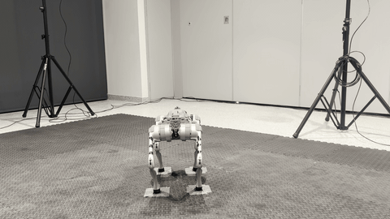

# ASTM WK86916 — Unitree Go2 Push-Over Test

This folder replays a standardized-procedure legged-robot test and applies the
certificate methods to the recorded outcomes (category **C3** in the paper).

The test follows ASTM Work Item **WK86916**, *New Test Methods for Disturbance
Rejection Testing of Legged Robots*, under development by ASTM Subcommittee
**F45.06**:

https://www.astm.org/membership-participation/technical-committees/workitems/workitem-wk86916

A Unitree Go2, running its manufacturer-provided control modules, is struck by
a swinging-pendulum impactor. See the paper for the setup — **Fig. 3d**.



## Reproducibility

### Measures

Two measures are certified per impact, both taken between the stabilized poses
before and after the impact event:

| column | measure | normalization bounds |
| --- | --- | --- |
| `pos_error_l2` | `l2`-norm position error | `[0, 0.10]` |
| `orientation_error_geodesic` | absolute yaw-angle error | `[0, 0.20]` |

Normalization is applied only while computing certificates; reported widths are
converted back to the original units. The bounds are fixed a priori, not read
off the data (`raw_max` is 0.072 and 0.154 respectively).

`data/UnitreeGo2.csv` holds 30 impacts, one row each.

### Run

```bash
python demo.py
python plot_demo.py
```

### Outputs

Everything is written to `data/`:

| file | contents | paper figure |
| --- | --- | --- |
| `normalization_metadata.csv` | bounds plus raw and normalized statistics per measure | — |
| `certificate_widths.csv` | per-`n` bounds and widths for every method and bank | — |
| `summary.csv` | final and mean widths, plus snapshots at n = 5, 10, 20, 30 | — |
| `width_curves.png` | certificate width vs. samples | **Fig. 6b** |
| `normalized_sequences.png` | the normalized measurement sequences | — |

## Method

- `CONFIDENCE = 0.95`, `kappa = 1.0`, `HORIZONS = (5, 10, 20, 30)`.
- Vincent et al. is run at gaps 0.05 / 0.10 / 0.20 / 0.30, against
  `BetaSkewed(2, 10)` for `pos_error_l2` and `BetaSkewed(2, 4)` for
  `orientation_error_geodesic`.
